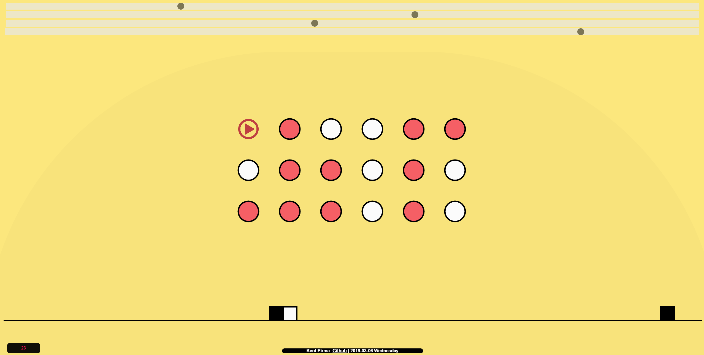

<h1>JS binary clock made by Kent Pirma.</h1>

First row: hours.

Second row: minutes.

Third row: seconds.

Sliders will adjust the size, position and color of the clock.

Click on the red play button to play music.

<a href="http://www.tlu.ee/~kpirma/clock/">http://www.tlu.ee/~kpirma/clock/</a>

     

