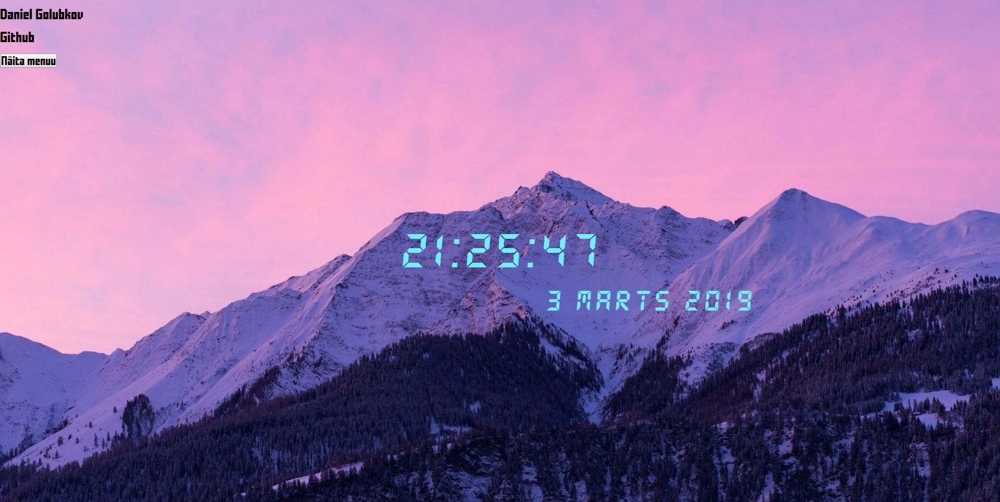

# 1kodutoo
Daniel Golubkov

Funktsionaalsus-
On olemas:
1. Autori nimi
2. Githubi-i link
3. Menüü
4. Nädalapäev
5. Aeg (tund:minut:sekund)
6. Kuupäev -ja aasta

Menüüs saab:
> Muuta tausta värvi.
> Muuta kella värvi.
> Peidata/näidata kuupäeva.
> Peidata/näidata nädalapäeva.
> Upload-ida oma arvutist tasutapilti, kui näiteks tavaline taustavärv ei meeldi.

Lisaks saab:
> Peidata/näidata menüü

Kella pilt:

