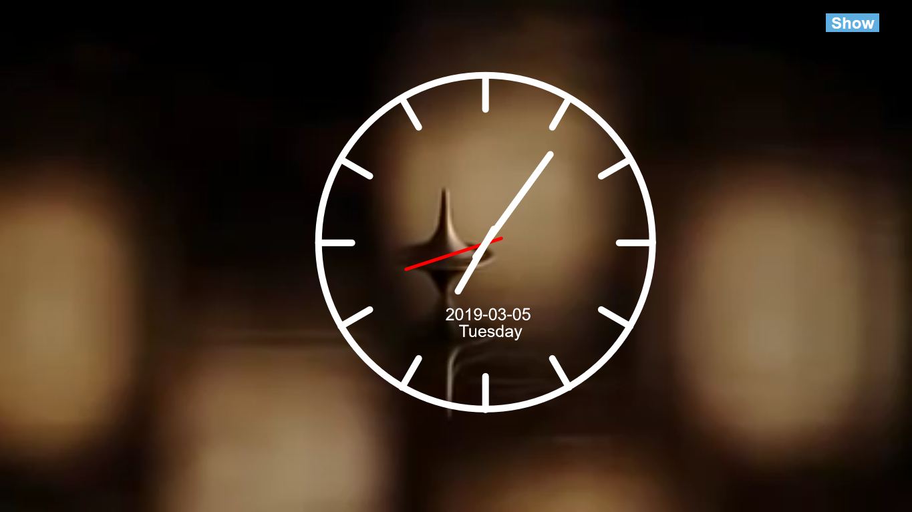

# Eesrakenduste-Arendamine
1. kodutöö - Kell

Autor: Kaspar Rasmus Eelmaa

Funktsionaalsus: Tegemist on analoogkellaga. Koodi järgi arvutatakse koordinaadid, kuidas seierid liikuma peavad.
Kella suurust on võimalik muuta slideriga. Samuti on võimalik muuta nii taustavärvi kui ka kella raami/seierite värvi.
Tegin ekraanile ala, mille sees saab kella liigutada, klikkides hiirega ala sisse liigub kell klikitud koordinaatidele.
Samuti on võimalik panna muusika mängima.

Kella asukoht: http://greeny.cs.tlu.ee/~kaspeel/EesrakendusteArendamine/1kodutoo/ ja http://www.tlu.ee/~ras127/kell/

