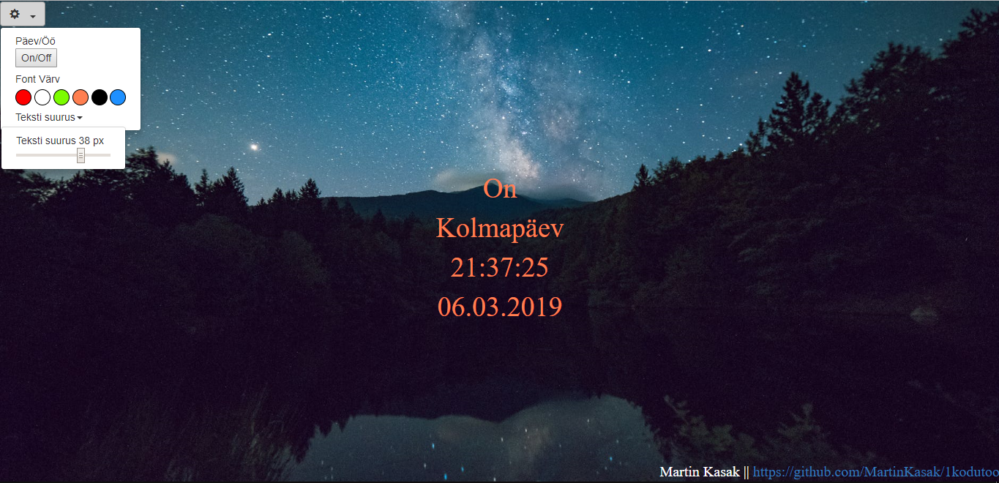

Eesrakenduste Arendamine

1. Kodutöö Kell

Tegemist lihtsa digitaalse kellaga. Kellal on võimalik vastavalt tahtele tagatausta vahetada kahe valiku põhjal(päevarežiim ja öörežiim). Lisaks on võimalik valida erinevate värvide vahel, mis muudavad nii numbreid kui ka kuupäeva. Viimasena on võimalik fondi suurust valida, erinevate valikute vahel.

